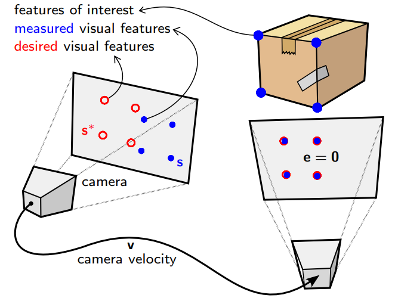
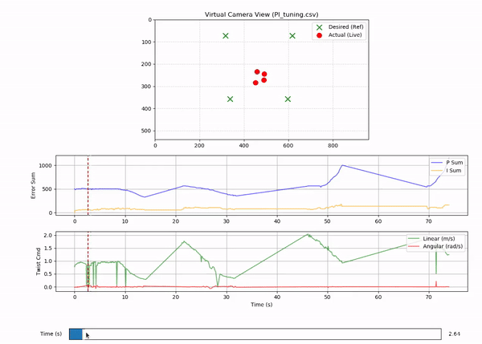

# Visual Error Controller

**Nutshell**: Simple, fast, but physically unrealistic

**Goal**: Baseline feedback controller


### Problem Statement

Following a human is a useful skill for robots, but implementing a solution with reasonable latency on small, low-cost platforms has 4 challenges

1. Finding the person; human appearance changes with orientation, distance and lighting.
2. Locking onto them as they walk behind things and reappear
3. Estimating position without depth cameras or LiDAR is mathematically ambiguous.
4. Trajectory planning and environment mapping with constraints on compute

# Solution

1. Use QR/ArUco codes to find and track people instead
3. **Use 'where they are' - 'where they should be' as the error, no mapping or depth needed!**



This is called "Image Based Visual Servoing" [Visual Servoing Paper](docs/visual_error_background_slides.pdf). It functions like a P controller, though I implement it as a PI controller to address steady-state error.

# Background

The PID feedback controller **relates motion** of QR code's corners **in the video feed to the car's motion in real life**. 


**See my [notes package](docs/Notes.pdf) notes for a simple, clever derivation!**

# Results


<table width="100%">
  <tr>
    <th>Image Base Visual Servoing</th>
    <th>Test Run Plotted</th>
  </tr>
  <tr>
    <td width="50%">
      
    </td>
    <td width="50%">
      
    </td>
  </tr>
</table>


# Implementation

## Dependencies
- ROS1 Noetic (Ubuntu 20.04)
- Python 3 with 'numpy', 'opencv'
- ZED SDK (for ZED Mini camera)
- 'rosserial' (for interfacing microcontroller with ROS messages)


```bash
# gaming controller/joystick and ROSserial dependencies
sudo apt install ros-noetic-joy ros-noetic-rosserial-python

# clone and build
git clone https://github.com/nodelabuofa/aruco-course-correction.git
cd ..
catkin_make
source devel/setup.bash

# Run visual servoing pipeline
roslaunch aruco_course_correction aruco.launch
```


# Key Limitations


Works reasonably when QR code radially oriented, but struggles in scenarios needing maneouvring as controller **assumes car can 'drive sideways'**, and also **doesn't plan motion.**


