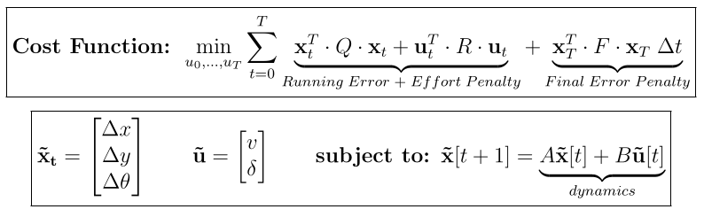
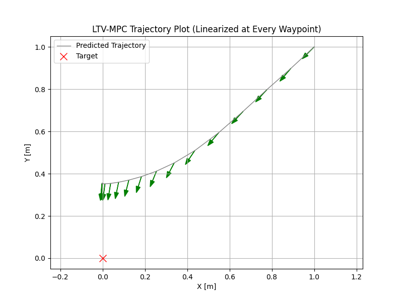
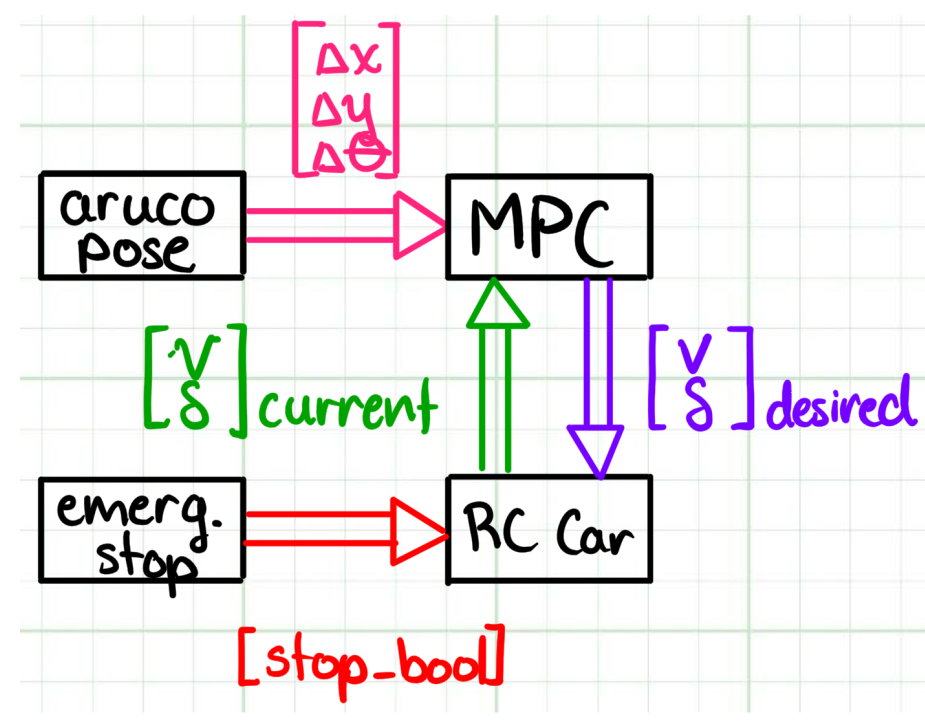

# Trajectory Planning Controller

**Goal**: shadow human, face them at fixed distance (0.2m) when they stop

**Nutshell**: plans trajectory over multiple time steps considering motion constraints.

**Significance**: intelligent, behaviour tunable, robust.

**Progress**: developing for deployment

# The Upgrade

 The visual error controller thought the car could jump left/right and go at Mach speed. This **predictive planner and controller** is actually aware of the car's kinematic model and control constraints.

# Solution  

As with most control-theory, we have a setpoint to reach. Uniquely, MPC manages planning future actions and implementing the feedback in one (slight oversimplification).

### Cost Function Formulation

Penalty tuning is needed to balance lazy response with aggressive overshooting.

### Analogy

Imagine you're driving down a windy road in thick fog. You:

1. Only see, and make a plan for, 50 meters ahead (prediction horizon).

2. Turn the wheel to start along that path; car moves forward 1 meter

3. You don't blindly follow the rest of the 49-meter plan. You look again, seeing a new 50 meters, and replan

# Background 

This is called a Linear Time Varying Model Predictive Controller; we linearize to simplify the nonlinear variation of sine, cosine and tangent. Note, we input actual previous state and control values here to get numeric matrices.

See my [notes package](docs/Derivation.pdf) notes for a full, simple, and I might even say clever derivation!

# Results

I've made a simplified plotter so anyone can run this locally. Here's an example run:

# Implementation

### ROS Node Network

One node estimates position to the ArUco/QR code, the other outputs the MPC's suggested next control action:

### Pseudocode

See my [notes package](docs/Pseudocode.pdf) notes for the full pseudocode explaining the rest of my code
