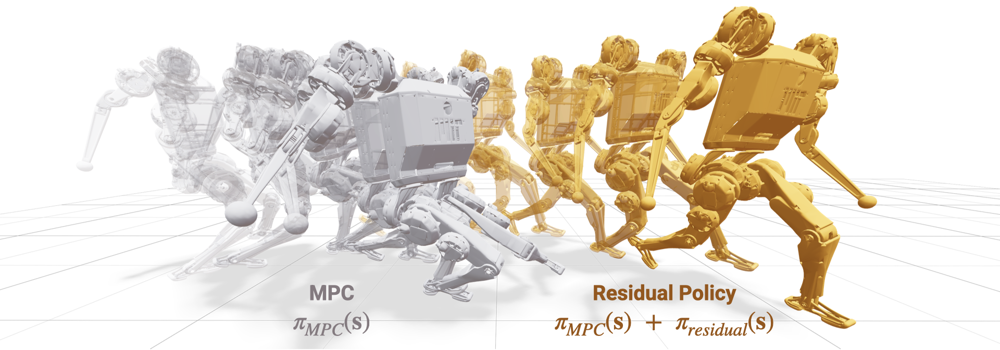

# Motion Planner with Residual RL for Behavioural Tuning

**Nutshell**: dynamically corrects behaviour of MPC, accounting for inaccuracy of simplified **kinematic** (trig) model

**Significance**: handles unmodeled **dynamics** (physics) (tire slip, lateral forces, suspension effects, etc.) without explicit physics-based modelling

**Progress**: will develop after MPC

# Background

The residual RL outputs a suggested control correction of its own that's simply scaled and added/subtracted with the MPC's control action

